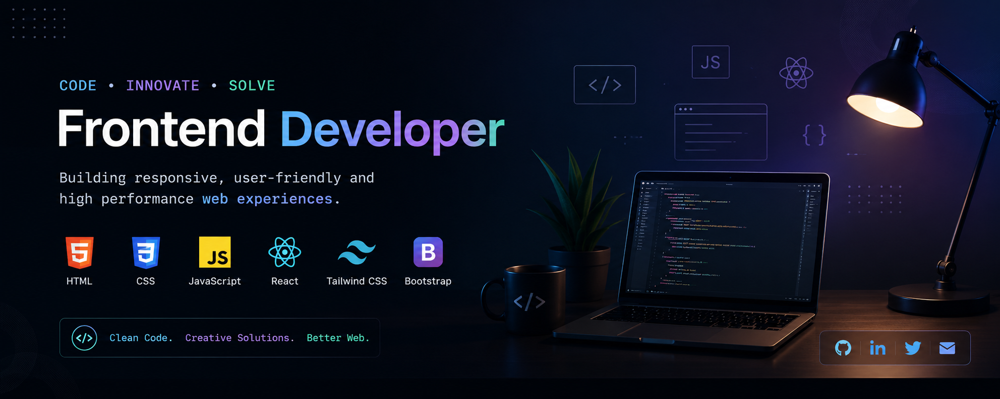

  

<h1 align="center">Hi 👋, I'm Atule Ojonugwa</h1>
<h3 align="center">A passionate frontend developer</h3>

  I build clean, responsive and user-friendly web experiences.

  

  

- 🌱 I’m currently learning **fundamentals of AI Engineering**

- 👨‍💻 All of my projects are available at [https://atules-portfolio.vercel.app/](https://atules-portfolio.vercel.app/)

- 💬 Ask me about **React, Tailwind, JavaScript**

- 📫 How to reach me **ojonugwaatule@gmail.com**

- ⚡ Fun fact **Coding is fun**

<h3 align="left">Connect with me:</h3>

<h3 align="left">Languages and Tools:</h3>

      

